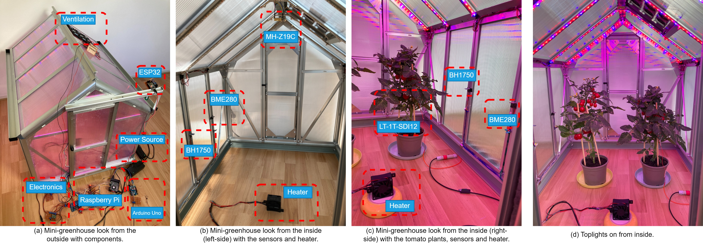
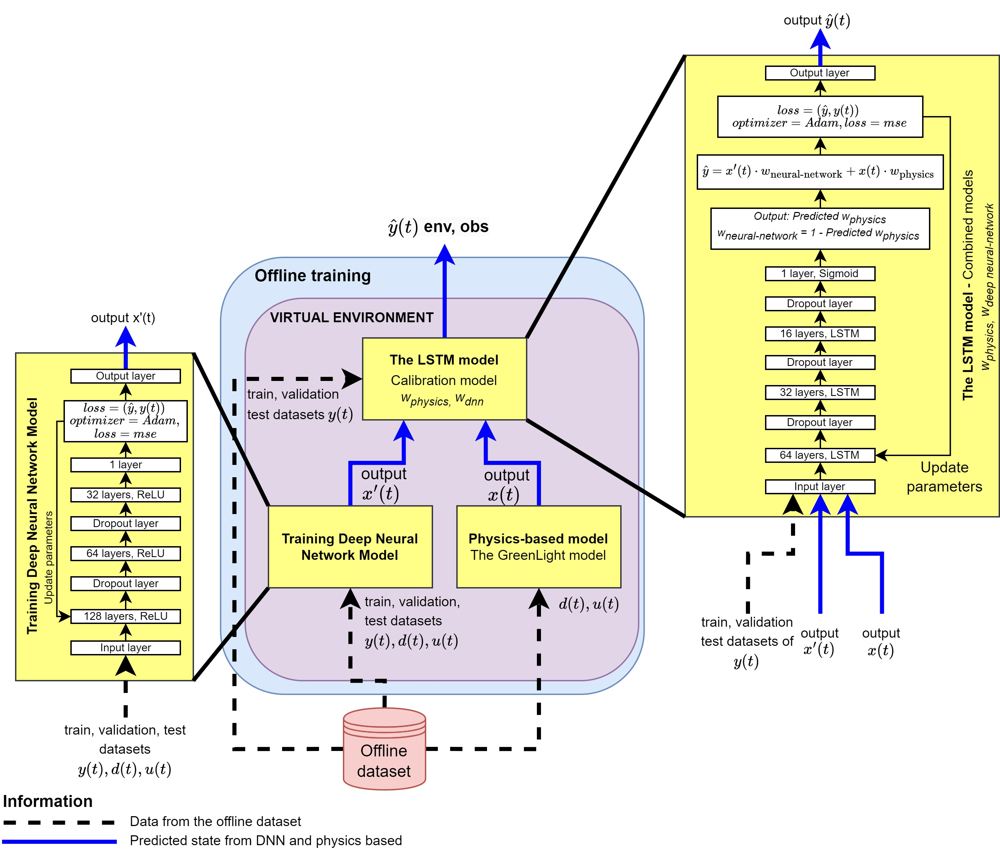

# Developing a Robust Simulation Model for an Autonomous Digital Twins System in an Experimental Greenhouse
Efraim Manurung, dr. Qingzhi Liu, dr. Önder Babur

Information Technology Group, Wageningen University, The Netherlands

## System design

## The mini-greenhouse

## Proposed model

## To-do list
updated [25/12/2024]
1. Add the main program files' explanations
2. Add more steps 
3. Add requirements.txt

# Cite as
To be filled! 

# Related repositories
- The IoT system for the Raspberry Pi (client) Firmware to monitor and control the mini-greenhouse with the sensors and actuators [mini-greenhouse-iot-system](https://github.com/EfraimManurung/mini-greenhouse-iot-system)
- The ESP32 Weather station to measure outside mini-greenhouse (outdoor measurements) [mini-greenhouse-esp32-weather-station-serial](https://github.com/EfraimManurung/mini-greenhouse-esp32-weather-station-serial)
- The example of white box (physics-based model) based on the GreenLight [mini-greenhouse-greenlight-model](https://github.com/EfraimManurung/mini-greenhouse-greenlight-model)
- The black box main programs to train the DNN and LSTM to predict climate inside the mini-greenhouse [mini-greenhouse-dnn-lstm-models](https://github.com/EfraimManurung/mini-greenhouse-dnn-lstm-models)
- This repository is to run the DRL model in the PC (server) for the offline and online real-time experiments [greenhouse-robust-model-for-adt](https://github.com/EfraimManurung/mini-greenhouse-model)

# Pre-requirements
1. Please install the MATLAB application.
2. Please install and follow the procedure from the [GreenLight](https://github.com/davkat1/GreenLight?tab=readme-ov-file#Using-the-model) as it's the main core program for the physics-based model.
3. Please install RLlib .whl from this repository in the Installling Ray folder. Follow this link to install it [Installing Ray](https://docs.ray.io/en/latest/ray-overview/installation.html).

# Using the model
1. Please follow the "Using the model" procedure from the original this link [GreenLight](https://github.com/davkat1/GreenLight?tab=readme-ov-file#Using-the-model). Do not forget to install the appropriate pre-requirements, such as the MATLAB version and DyMoMa package. Also, please don't forget to set the path of the folders appropriately.
2. After it can run the example model of the original GreenLight. Try to run the exampleMiniGreenhouse in this repository [mini-greenhouse-greenlight-model](https://github.com/EfraimManurung/mini-greenhouse-greenlight-model). The .mat file is inside the Code/runScenarios/exampleMiniGreenhouse.m. In here, it can run the example based on the parameters for the mini-greenhouse. These folders also need to be in the MATLAB path.
3. After steps 1 and 2, run the main-run-offline.py in this repository [mini-greenhouse-model](https://github.com/EfraimManurung/mini-greenhouse-model), and do not forget to set the  path for the MATLAB folder to the MATLAB application. In here, the application can run the DNN and LSTM models. In addition, with main-run.py, we can run the DRL model. 
4. to be filled!

# Explanation of the main program
### main-train
Explanation about the [`main-train.py`](https://github.com/EfraimManurung/mini-greenhouse-model/blob/main/main-run.py)

### main-run-offline
Explanation about the [`main-run-offline.py`](https://github.com/EfraimManurung/mini-greenhouse-model/blob/main/main-run-offline.py)

### main-run
Explanation about the [`main-run.py`](https://github.com/EfraimManurung/mini-greenhouse-model/blob/main/main-run.py)

# Reference
1. David Katzin, Simon van Mourik, Frank Kempkes, and Eldert J. Van Henten. 2020. “GreenLight - An Open Source Model for Greenhouses with Supplemental Lighting: Evaluation of Heat Requirements under LED and HPS Lamps.” Biosystems Engineering 194: 61–81. https://doi.org/10.1016/j.biosystemseng.2020.03.010
2. To be filled!
