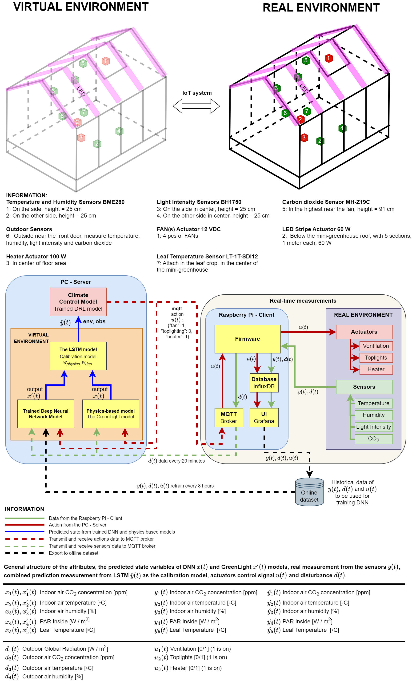

# Developing a Robust Simulation Model for an Autonomous Digital Twin System in an Experimental Greenhouse

**Authors:**  
Efraim Manurung, M.Sc., Dr. Qingzhi Liu \
*Information Technology Group, Wageningen University, The Netherlands*

---

## 🌱 Project Overview
This repository contains the **simulation framework** for developing a **robust and calibrated digital twin system** in a mini-greenhouse environment.  
The goal is to integrate **physics-based models (GreenLight)** with **data-driven approaches (DNN, LSTM, DRL)** for autonomous greenhouse climate control.  

---

## 🏗️ System Design


---

## 🏡 The Mini-Greenhouse
A small-scale experimental greenhouse equipped with climate sensors, actuators, and leaf sensors:  


---

## The Hardware Design


---

## The Power Supply Design


## 🤖 Proposed Model
Integration of DNN, LSTM, and DRL models into the digital twin loop with online calibration:  


---

## ✅ Changelog

- [19-08-2025]
  - Added initial `requirements.txt` with core dependencies (NumPy, Pandas, SciPy, Matplotlib, Seaborn, Scikit-learn, TensorFlow, PyTorch, Ray RLlib, Plotly, Tabulate, MATLAB Engine API, tqdm).
  - Cleaned unnecessary libraries from `pip freeze` dump to keep the environment minimal and reproducible.
  - Changed system design.

---

## 📂 Related Repositories
This repository is part of a larger **mini-greenhouse digital twin ecosystem**:

- 🌐 [mini-greenhouse-iot-system](https://github.com/EfraimManurung/mini-greenhouse-iot-system) – IoT firmware for Raspberry Pi (sensors & actuators)  
- 🌦️ [mini-greenhouse-esp32-weather-station-serial](https://github.com/EfraimManurung/mini-greenhouse-esp32-weather-station-serial) – ESP32 weather station for outdoor measurements  
- 📊 [mini-greenhouse-greenlight-model](https://github.com/EfraimManurung/mini-greenhouse-greenlight-model) – Physics-based white-box model (GreenLight)  
- 🧠 [mini-greenhouse-dnn-lstm-models](https://github.com/EfraimManurung/mini-greenhouse-dnn-lstm-models) – DNN & LSTM black-box models  
- 🎛️ [mini-greenhouse-model](https://github.com/EfraimManurung/mini-greenhouse-model) – This repo: DRL model execution (offline & real-time experiments)  

---

## ⚙️ Pre-requirements
1. [MATLAB](https://www.mathworks.com/products/matlab.html) (required for GreenLight)  
2. Install and follow setup from the [GreenLight model](https://github.com/davkat1/GreenLight?tab=readme-ov-file#Using-the-model)  
3. Install **Ray RLlib** from the `.whl` file as described in [Ray Installation](https://docs.ray.io/en/latest/ray-overview/installation.html)  

---

## 🚀 Using the Model
1. Follow the **"Using the model"** procedure from the [GreenLight documentation](https://github.com/davkat1/GreenLight?tab=readme-ov-file#Using-the-model).  
   - Ensure MATLAB version & DyMoMa package are installed.  
   - Set appropriate paths for the GreenLight folders.  

2. Run the **example mini-greenhouse** model:  
   - Repository: [mini-greenhouse-greenlight-model](https://github.com/EfraimManurung/mini-greenhouse-greenlight-model)  
   - File: `Code/runScenarios/exampleMiniGreenhouse.m`  
   - This runs the scaled-down mini-greenhouse parameters.  

3. Run the offline DRL/DNN/LSTM simulations (recommended if you do not have the Raspberry Pi setup):  
   ```bash
   python main-run-offline.py